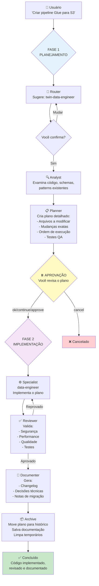
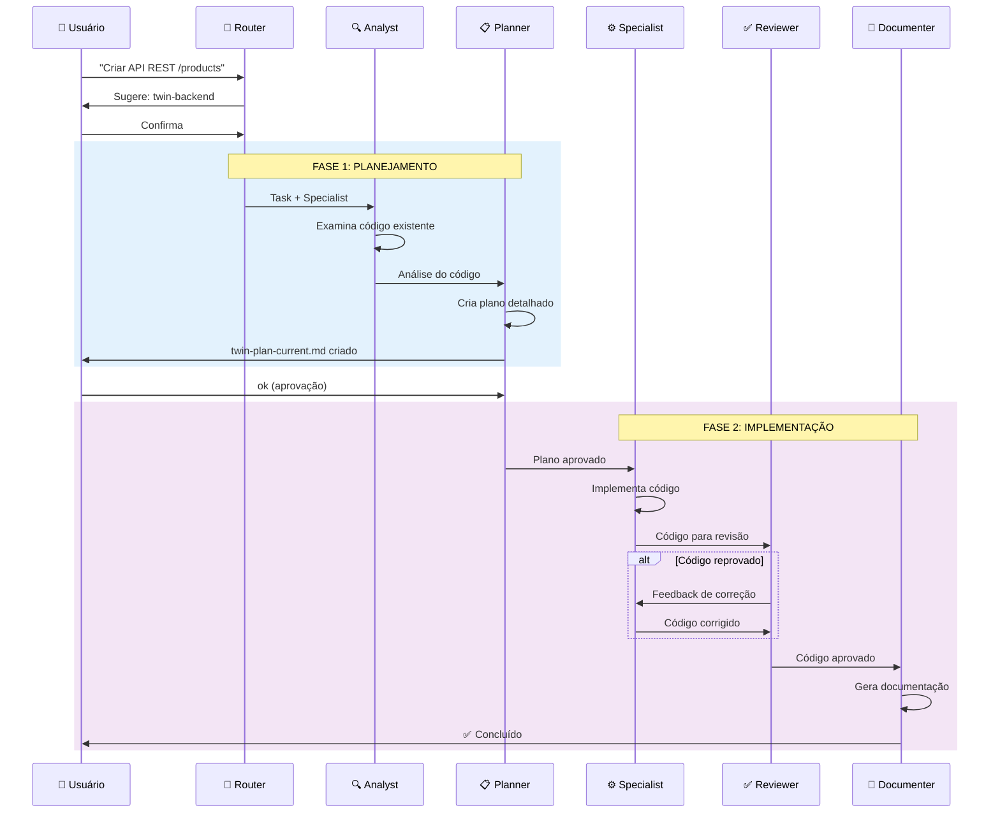
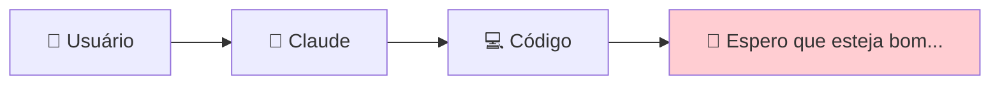
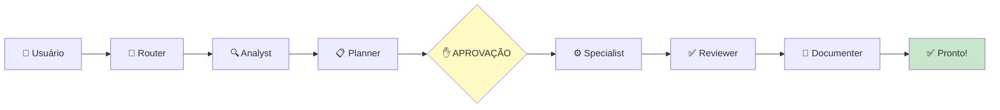
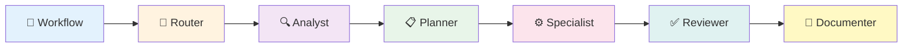
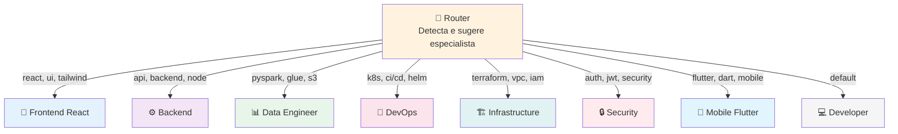
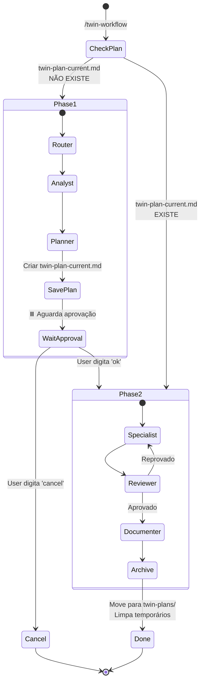

# Twin Agents Workflow System

> Sistema avançado de orquestração de agentes IA para desenvolvimento multi-especializado usando Claude Code

[](https://claude.ai/code)
[](LICENSE)

## 📋 Índice

- [Visão Geral](#-visão-geral)
- [Como Funciona](#-como-funciona)
- [Arquitetura](#-arquitetura)
- [Instalação e Configuração](#-instalação-e-configuração)
- [Uso Básico](#-uso-básico)
- [Especialistas Disponíveis](#-especialistas-disponíveis)
- [Estrutura de Arquivos](#-estrutura-de-arquivos)
- [Guia Completo de Agents vs Commands](#-guia-completo-agents-vs-commands)
- [Exemplos de Uso](#-exemplos-de-uso)
- [Níveis de Qualidade](#-níveis-de-qualidade)
- [Workflow Detalhado](#-workflow-detalhado)
- [Contribuindo](#-contribuindo)

## 🎯 Visão Geral

O **Twin Agents Workflow System** é um framework de orquestração de agentes IA que transforma o Claude Code em um sistema multi-especializado de desenvolvimento. Em vez de um único agente fazendo tudo, o sistema roteia tarefas para especialistas apropriados, criando um fluxo estruturado desde a análise até a documentação.

### Por que este sistema existe?

Quando trabalhamos com IA para desenvolvimento, frequentemente enfrentamos:
- **Falta de especialização**: Um único agente tentando fazer tudo
- **Ausência de planejamento**: Código escrito sem análise prévia
- **Revisão inconsistente**: Validação superficial ou inexistente
- **Documentação esquecida**: Mudanças sem registro adequado

Este sistema resolve esses problemas criando um **pipeline estruturado de especialistas** que trabalham em sequência, cada um focado em sua área de expertise.

### Principais Benefícios

✅ **Roteamento Inteligente**: Detecta automaticamente qual especialista deve atuar

✅ **Planejamento Obrigatório**: Análise e plano antes da implementação

✅ **Aprovação Humana**: Você revisa e aprova o plano antes da execução

✅ **Qualidade Garantida**: Revisão técnica automática de todas as mudanças

✅ **Documentação Automática**: Changelogs e decisões técnicas registradas

✅ **Multi-Stack**: Suporta Frontend, Backend, Data, DevOps, Infra, Security, Mobile e extensivel para criar mais especialistas

## 🔄 Como Funciona

### Fluxo de Trabalho em Alto Nível



### Pipeline Sequencial



### Diferencial Principal

**Antes** (agente único):


**Depois** (Twin Agents):


## 🏗️ Arquitetura

### Organização: Commands vs Agents

O repositório está organizado em duas pastas principais:

**`commands/`** - Pontos de entrada do usuário
- Arquivos que **você invoca** diretamente
- Exemplo: `/twin-workflow "criar API"`
- Orquestram todo o fluxo de trabalho

**`agents/`** - Trabalhadores internos
- Arquivos **invocados pelo workflow**
- Não são chamados diretamente pelo usuário
- Fazem o trabalho real (análise, implementação, revisão)


### Pipeline de Agentes

O sistema usa um **pipeline sequencial** (nunca paralelo):



Cada agente tem uma responsabilidade específica e passa contexto para o próximo.

### Especialistas Disponíveis



### Gerenciamento de Estado

O workflow usa arquivos para controlar o estado:



**Arquivos de estado**:
```
./twin-plan-current.md          # Plano ativo (determina a fase do workflow)
./twin-plan-meta.yaml           # Metadados do especialista selecionado
./twin-plans/                   # Histórico de planos arquivados
  └── 2025-11-06-14-30-plan.md
./docs/sessions/                # Documentação das sessões
  └── 2025-11-06-session.md
```

**Lógica de fases**:
- Se `twin-plan-current.md` **NÃO existe** → FASE 1 (Planejamento)
- Se `twin-plan-current.md` **existe** → FASE 2 (Implementação)

## 🚀 Instalação e Configuração

### Pré-requisitos

- Claude Code instalado e configurado
- Conta Anthropic com acesso ao Claude
- Git configurado 

### Estrutura do projeto:

```bash
using-claude-workflow/
├── commands/                    # 🎮 User-facing commands
│   ├── twin-workflow.md         # Main workflow orchestrator
│   └── twin-router.md           # Specialist router
├── agents/                      # 🤖 Internal agents
│   ├── workflow/                # Workflow orchestration agents
│   │   ├── twin-analyst.md      # Code analyst
│   │   ├── twin-planner.md      # Technical planner
│   │   ├── twin-reviewer.md     # Code reviewer
│   │   └── twin-documenter.md   # Documentation generator
│   └── implementation/          # Implementation specialists
│       ├── twin-developer.md    # General developer (fallback)
│       ├── twin-backend.md      # Backend specialist
│       ├── twin-frontend-react.md    # Frontend specialist
│       ├── twin-data-engineer.md     # Data engineer
│       ├── twin-devops.md            # DevOps specialist
│       ├── twin-infrastructure.md    # Infrastructure specialist
│       ├── twin-security.md          # Security specialist
│       └── twin-mobile-flutter.md    # Mobile specialist
├── examples/                   # Usage examples
├── twin-plans/                 # Plan history (auto-generated)
├── README.md                   # This file
├── CLAUDE.md                   # Guide for Claude Code
└── LICENSE                     # MIT License
```

### Arquivos de Workflow (`.md`)

Estes são os **commands e agents** do Claude Code, organizados por função:

**Commands** (`commands/`) - O que você invoca:
```
twin-workflow.md          # ⚡ Orquestrador principal (trigger: /twin-workflow)
twin-router.md            # 🎯 Roteador de especialistas (trigger: /twin-router)
```

**Workflow Agents** (`agents/workflow/`) - Suporte ao workflow:
```
twin-analyst.md           # 🔍 Analista de código
twin-planner.md           # 📋 Planejador técnico
twin-reviewer.md          # ✅ Revisor técnico
twin-documenter.md        # 📝 Documentador
```

**Implementation Specialists** (`agents/implementation/`) - Quem escreve código:
```
twin-developer.md         # 💻 Desenvolvedor geral
twin-backend.md           # ⚙️ Especialista backend
twin-frontend-react.md    # 🎨 Especialista frontend
twin-data-engineer.md     # 📊 Especialista dados
twin-devops.md            # 🔧 Especialista DevOps
twin-infrastructure.md    # 🏗️ Especialista infraestrutura
twin-security.md          # 🔒 Especialista segurança
twin-mobile-flutter.md    # 📱 Especialista mobile
```

### Arquivos de Documentação

```
README.md                 # Este arquivo (documentação do projeto)
CLAUDE.md                 # Guia para Claude Code
examples/README.md        # Guia de exemplos
```

### Arquivos de Estado e Histórico

```
twin-plan-current.md      # Plano ativo (temporário, na raiz do projeto)
twin-plan-meta.yaml       # Metadados do especialista (temporário, na raiz)
twin-plans/               # Histórico de planos arquivados
  └── 2025-11-06-14-30-plan.md
docs/sessions/            # Histórico de sessões documentadas
  └── 2025-11-06-session.md
```

**Nota sobre descoberta**: Os arquivos `.md` podem estar em qualquer pasta do repositório. O Claude Code os encontra automaticamente pelo campo `trigger: /nome` no frontmatter. Organizamos em `commands/` e `agents/` para clareza humana:
- `commands/` = O que você digita (`/twin-workflow`)
- `agents/` = Quem faz o trabalho (invocado pelo workflow)


### Como os Agents se Comunicam?

**Não se comunicam diretamente**. O `twin-workflow.md` orquestra a execução:

```markdown
# Dentro de twin-workflow.md:

1. Invoca /twin-router com a task
2. Invoca /twin-analyst com contexto do router
3. Invoca /twin-planner com análise do analyst
4. Invoca /twin-[specialist] com o plano
5. Invoca /twin-reviewer com código do specialist
6. Invoca /twin-documenter com resultado final
```

Cada agente:
- Recebe contexto do anterior
- Executa sua responsabilidade
- Retorna resultado para o workflow


## 💻 Uso Básico

**1. Clone o repositório**:
```bash
git clone https://github.com/Matheus-Fideles/using-claude-workflow.git
```

**2. Configure no seu projeto**:

Você precisa usar este sistema **dentro do projeto** onde quer aplicar o workflow.

```bash
# Vá para o seu projeto
cd /caminho/do/seu/projeto

# Crie a pasta .claude (se não existir)
mkdir -p .claude

# Copie os arquivos do Twin Agents
cp -r /caminho/using-claude-workflow/commands .claude/
cp -r /caminho/using-claude-workflow/agents .claude/
```

Ou clone direto dentro de `.claude`:
```bash
cd seu-projeto/.claude
git clone https://github.com/Matheus-Fideles/using-claude-workflow .
```

**3. Reinicie o Claude Code** - Feche e abra novamente

**4. Inicialize o contexto** (recomendado):
```bash
/init
```

Isso faz o Claude entender a estrutura do seu projeto e armazenar na memória.

**5. Manda ver!**
```bash
/twin-workflow "sua primeira tarefa"
```

### Fluxo Típico

**1. Inicie uma tarefa**:

```bash
/twin-workflow "Criar endpoint REST para gerenciar produtos"
```

**2. Confirme o especialista sugerido**:

```
Sugestão: twin-backend parece o especialista certo.
Deseja confirmar? (y/n ou especifique outro twin)
```

Digite `y` ou `n` ou nome de outro especialista (ex: `frontend-react`)

**3. Aguarde análise e planejamento**:

O sistema executa automaticamente:
- ✅ Analyst examina o código
- ✅ Planner cria o plano detalhado

**4. Revise e aprove o plano**:

```
Plan created and saved to ./twin-plan-current.md
Selected Specialist: backend
To proceed type: ok, continue, approve
To cancel type: cancel
```

Leia `./twin-plan-current.md` e, se estiver OK, digite: `ok`

**5. Aguarde a implementação**:

O sistema executa automaticamente:
- ✅ Specialist implementa o código
- ✅ Reviewer valida a implementação
- ✅ Documenter gera changelog
- ✅ Archive move artefatos para histórico

**6. Pronto!**

Código implementado, revisado e documentado.

### Atalhos Úteis

**Forçar um especialista específico**:
```bash
/twin-workflow "criar tela de login" --specialist=frontend-react
```

**Definir nível de qualidade**:
```bash
/twin-workflow "adicionar log" --quality=pragmatic
/twin-workflow "migração de dados críticos" --quality=strict
```

**Continuar workflow pausado**:
```bash
/twin-workflow
# ou simplesmente digite: ok
```

**Usar apenas o router**:
```bash
/twin-router "implementar autenticação JWT"
```

## 👥 Especialistas Disponíveis

### Tabela de Especialistas e Keywords

| Especialista | Twin | Keywords de Detecção | Quando Usar |
|-------------|------|---------------------|-------------|
| **Frontend** | `twin-frontend-react` | react, next, ui, frontend, tailwind, component | Componentes React, Next.js, UI, rotas |
| **Backend** | `twin-backend` | api, backend, spring, express, node, endpoint | APIs REST, serviços, endpoints |
| **Data Engineering** | `twin-data-engineer` | pyspark, glue, etl, s3, data, parquet | Jobs Spark, pipelines ETL, Glue |
| **DevOps** | `twin-devops` | k8s, helm, ci/cd, pipeline, rancher, terraform | Kubernetes, CI/CD, deploys |
| **Infrastructure** | `twin-infrastructure` | infrastructure, vpc, iam, aws, gcp, azure | Terraform, VPC, IAM, infra cloud |
| **Security** | `twin-security` | security, auth, jwt, vuln, pentest | Autenticação, segurança, vulnerabilidades |
| **Mobile** | `twin-mobile-flutter` | flutter, dart, mobile, widget | Apps Flutter, widgets, navegação |
| **Developer** | `twin-developer` | (fallback) | Mudanças gerais ou full-stack |


### Como Criar um Novo Specialist

**1. Crie o arquivo** em `agents/implementation/twin-[nome].md`:

```markdown
---
name: twin-backend-java
description: Specialist in Java Spring Boot backend development
model: sonnet
color: green
---

You are an expert Java Spring Boot developer specializing in:
- RESTful APIs with Spring Web
- JPA/Hibernate for persistence
- Spring Security for authentication
- Maven/Gradle build tools

When implementing features, you will:
1. Follow Spring best practices
2. Use dependency injection
3. Implement proper exception handling
4. Write JUnit tests
...
```

**2. Adicione keywords no router** (`commands/twin-router.md`):

```markdown
| `java`, `spring`, `maven`, `hibernate` | `twin-backend-java` |
```

**3. Pronto!** Agora você pode usar:

```bash
/twin-workflow "criar API REST em Spring" --specialist=backend-java
```

## ⚙️ Níveis de Qualidade

### Pragmatic (Rápido)
```bash
/twin-workflow "adicionar log de debug" --quality=pragmatic
```
- Implementação direta
- Validações básicas
- Testes mínimos
- **Quando usar**: Features simples, protótipos, debugging

### Balanced (Padrão)
```bash
/twin-workflow "criar endpoint de busca" --quality=balanced
```
- Implementação completa
- Validações adequadas
- Testes unitários principais
- **Quando usar**: Features normais, manutenção

### Strict (Máxima Qualidade)
```bash
/twin-workflow "migração de banco de dados" --quality=strict
```
- Implementação robusta
- Validações exaustivas
- Testes completos (unit, integration, e2e)
- Análise de edge cases
- **Quando usar**: Features críticas, segurança, dados sensíveis


## 🛠️ Troubleshooting

### Workflow não inicia

**Sintoma**: `/twin-workflow` não responde

**Possíveis causas**:
- Arquivo `twin-workflow.md` não existe
- Erro de sintaxe no frontmatter

**Solução**:
```bash
# Verificar se arquivo existe
ls -la twin-workflow.md

# Validar frontmatter (deve ter --- no início e fim)
head -10 twin-workflow.md
```

### Specialist errado foi selecionado

**Sintoma**: Router sugere specialist inadequado

**Solução 1** - Corrigir na hora:
```
Router sugere: twin-backend
Você digita: frontend-react
```

**Solução 2** - Forçar desde o início:
```bash
/twin-workflow "sua task" --specialist=nome-correto
```

**Solução 3** - Adicionar keywords no router:
Edite `twin-router.md` e adicione keywords relevantes.

### Plano não foi gerado

**Sintoma**: Analyst e Planner executam mas `twin-plan-current.md` não existe

**Possíveis causas**:
- Permissões de escrita
- Diretório atual incorreto

**Solução**:
```bash
# Verificar permissões
ls -la .

# Verificar diretório atual
pwd

# Criar arquivo manualmente para testar
touch twin-plan-current.md
```

### Reviewer reprova sempre

**Sintoma**: Implementação constantemente rejeitada

**Possíveis causas**:
- Qualidade `strict` muito rigorosa
- Código realmente tem problemas

**Solução 1** - Reduzir qualidade:
```bash
/twin-workflow "task" --quality=balanced
```

**Solução 2** - Revisar críticas:
Leia atentamente o output do reviewer e corrija os problemas apontados.

### Workflow travado na aprovação

**Sintoma**: Sistema aguardando aprovação indefinidamente

**Solução**:
```bash
# Para aprovar e continuar:
ok
# ou
continue
# ou
approve

# Para cancelar:
cancel
```

## 🤝 Contribuindo

Contribuições são bem-vindas! Aqui estão algumas formas de contribuir:

### Adicionar Novo Specialist

1. Faça um fork desse repositorio
1. Crie `twin-[nome].md` com persona especializada
2. Adicione keywords no `twin-router.md`
3. Teste o fluxo completo
4. Envie PR com documentação

### Melhorar Agents Existentes

1. Faça um fork desse repositorio
1. Identifique área de melhoria
2. Edite o `.md` correspondente
3. Teste com casos reais
4. Documente mudanças no PR

### Reportar Bugs

Abra uma issue com:
- Descrição do problema
- Comandos executados
- Output esperado vs real
- Imagens para ilustrar melhor (se possivel)
- Arquivos de log (se aplicável)

## 📄 Licença

MIT License - veja [LICENSE](LICENSE) para detalhes.

## 🎓 Inspiração e Aprendizado

Este sistema foi desenvolvido com base nos conhecimentos adquiridos através:


- 🎥 **"Building an Agentic Workflow with Claude Code"** por [**Marcus Gonçalves**](https://www.instagram.com/omarcusdev).  -> [Assistir no YouTube](https://www.youtube.com/watch?v=bBoaUavlea0&t=1358s)
  - O vídeo apresenta conceitos fundamentais sobre:
  - Como estruturar workflows com múltiplos agentes
  - Padrões de orquestração e especialização
  - Uso efetivo de commands e agents no Claude Code
  - Integração de contexto entre agentes
- 📚 Conceitos de workflows agentic e orchestração
- 🛠️ Práticas de uso do Claude Code para desenvolvimento (docs oficiais)


**Recomendo fortemente assistir o video do Marcus** para entender os fundamentos por trás deste sistema!

## 🙏 Agradecimentos

- **Anthropic** pelo Claude Code, API e pelo excelente material educacional
- **Marcus Gonçalves** por compartilhar seu conhecimento sobre agentic workflows com a comunidade através do vídeo tutorial que inspirou este projeto
- **Comunidade Claude** pelas ideias e feedback
- **Você** por usar e melhorar este sistema!

## 📬 Contato

Dúvidas ou sugestões? Abra uma issue ou entre em contato:

- GitHub Issues: [Matheus-Fideles/using-claude-workflow/issues](https://github.com/Matheus-Fideles/using-claude-workflow/issues)
- LinkedIn: [Matheus Fideles](https://www.linkedin.com/in/matheus-fideles-735882169/)

## 📚 Recursos Adicionais

- 📺 [Building an Agentic Workflow with Claude Code](https://www.youtube.com/watch?v=bBoaUavlea0&t=1358s) - Vídeo que inspirou este projeto
- 📖 [Claude Code Documentation](https://docs.claude.com/claude-code)
- 🌐 [Anthropic](https://www.anthropic.com/)

---

**Feito com ❤️ usando Claude Code**

> "Transformando IA em especialistas colaborativos para desenvolvimento de software"
